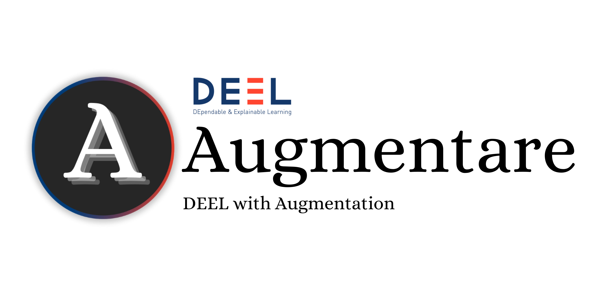
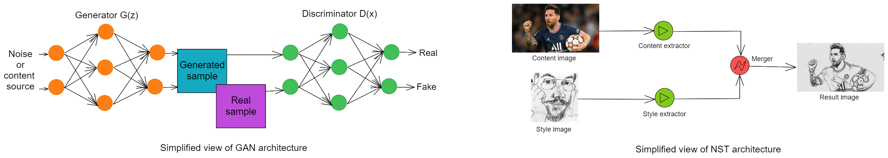
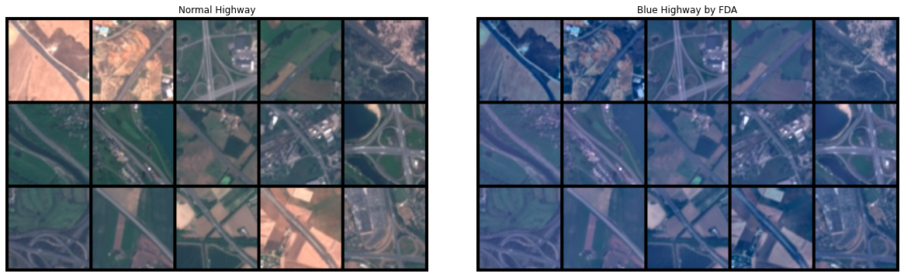
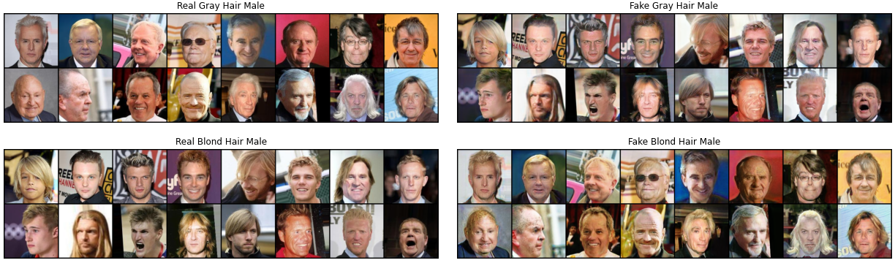

<div align="center">
    
</div>
<br>

<div align="center">
    <a href="#">
        
    </a>
    <!-- <a href="https://github.com/deel-ai/deel-with-augmentation/actions/workflows/python-lints.yml">
        
    </a>
    <a href="https://github.com/deel-ai/deel-with-augmentation/actions/workflows/python-tests-torch.yml">
         -->
    </a>
    <!-- <a href="https://github.com/deel-ai/xplique/actions/workflows/python-publish.yml">
        
    </a> -->
    <a href="#">
        
    </a>
</div>
<br>

<p align="center">
    <b>DEEL With Augmentation</b> is a repository which implements several ML techniques to generatively augment the data and that analyzes those methods from a Fairness perspective.
</p>

This repository includes two types of ML approaches to generate synthetic data to augment your training dataset: Generative Adversarial Networks (GANs) and Style Transfer (ST).

<div class=figure>
  <p align="center" width="100%">  </p>
</div>

The main focus of this work is to analyze the ability of those methods to efficiently adress bias issues. More specifically, we wanted to check that augmenting a minority group (*i.e.* a group that is under represented) with those approaches could alleviate the drop in performance for the sensitive group that is usually observable when training a model on the unaugmented dataset. We made a number of experiments on the EuroSat dataset where the minority group is the satellite images with a *blue veil* and on the CelebA dataset on which multiple minority groups could be defined.

## 🧪 Experiment Results

- [**DEEL With Eurosat Bias**](https://colab.research.google.com/drive/1Apawd1NXjoXweD7gEvTOoP6GRgdex8xz?authuser=3) experiment's summary
- [**DEEL With CelebA Bias**](https://colab.research.google.com/drive/1XZIJY2xIc0sxnqmytSNq6X1LIZLxMfiT?authuser=3) experiment's summary

<details>
<summary><b>Experiments on Eurosat</b></summary>

| **Bias in EuroSAT** | Notebook           |
  | :--------------------- | :----------------: |
  | Summary | [](https://colab.research.google.com/drive/1Apawd1NXjoXweD7gEvTOoP6GRgdex8xz?authuser=3) |
  | Fourier Domain Adaptation (FDA) | [](https://colab.research.google.com/drive/1LCLevUaAERtI-K6xYSHCAuJ00lAPjFBe?authuser=3) |
  | Style Flow | [](https://colab.research.google.com/drive/1DUzOwHdQCgiTf2wA7Da0U06dkRba5Kgg?authuser=3) |
  | Contrastive Coherence Preserving Loss for Versatile Style Transfer (CCPL) | [](https://colab.research.google.com/drive/1KwmrpTAX0QjSC4XI_SHRMqnlh-aGQ3Yx?authuser=3) |
  | Adaptive Instance Normalization (AdaIN)| [](https://colab.research.google.com/drive/10jBKY2sIVxBFt3ENHUFQIRm0Z6EfBII8?authuser=3) |
  | Neural Neighbor Style Transfer (NNST)| [](https://colab.research.google.com/drive/1ZPj0TXa6FxVvxcrmXhXIjhomPOSEefAF?authuser=3) |
  | GAN + ST| [](https://colab.research.google.com/drive/1xyqKdJgG_2BLcW4GrLdHMzZUILXLySm6?authuser=3) |
  | XAI Attributions| [](https://colab.research.google.com/drive/1znjtaQzYZQ5znhf_fqJEv_nMIyX9lobS?authuser=3) |
  | XAI Metrics| [](https://colab.research.google.com/drive/1hcLuG_KwFQ89qtqcsWcXBjt4WcSbN93i?authuser=3) |

  <div class=figure>
  <p align="center" width="100%"> 
  <p align="center"> An example of a case where we used FDA to change the style of highway images.
  </div>
</details>

<details>
<summary><b>Experiments on CelebA</b></summary>

| **Bias in CelebA** | Notebook |
  | :--------------------- | :----------------: |
  | Summary | [](https://colab.research.google.com/drive/1XZIJY2xIc0sxnqmytSNq6X1LIZLxMfiT?authuser=3) |
  | OpenCV   | [](https://colab.research.google.com/drive/1O1CVEL7bvfwbEC9PypY-szkQtRa1aM6g?authuser=3) |
  | DCGAN  | [](https://colab.research.google.com/drive/1yJ8r9X2g5Y9vSJavxwePRiCirOSzg3og?authuser=3) |
  | CycleGAN | [](https://colab.research.google.com/drive/16gbok_6Bls-g_uu_rzeCIDBJQrn77BlK?authuser=3) |
  | ProGAN | [](https://colab.research.google.com/drive/14GZnuvUij3UOMNFcQr6Fu_WVg8VeZXRx?authuser=3) |
  | All methods (including DDPM) | [](https://colab.research.google.com/drive/1JopH1bXld_NK504pXmPmvg5jN9uyA521?authuser=3) |

  <div class=figure>
  <p align="center" width="100%"> 
  <p align="center"> An example of a case where we used CycleGAN to change the hair color of male.
  </div>
</details>

## 🐍 The Augmentation Package

In this repository we packaged all the code used for our experiments to allow both: reproducibility and usability as a Python package of the augmentation methods.

<details>
<summary><b>Getting Started</b></summary>

**Augmentare** requires a version of python higher than 3.7 and several libraries including Pytorch and Numpy. Installation can be done using:

```bash
git clone https://github.com/deel-ai/augmentare.git
cd augmentare
python setup.py install
```

Now that Augmentare is installed.

**Generative Adversarial Networks Methods**

```python
# Augmentare Imports
import augmentare
from augmentare.methods.gan import *
from augmentare.plots.plot_losses import plot_losses_gan
from augmentare.plots.plot_samples import plot_image
```

All GANs models share a common API. You can find out more about it [here]().

**Style Transfer Methods**

```python
# Augmentare Imports
import augmentare
from augmentare.methods.style_transfer import *
from augmentare.plots.plot_losses import plot_losses
```

All NST models share a common API. You can find out more about it [here]()

</details>

<details>
<summary><b>Generative Adversarial Networks</b></summary>

The library includes a `gan` module where various GAN models are available. They all come with explanations, tutorials, and links to official articles:

| **GAN Method** | Source                                   | Tutorial                                                                     |
|:---------------|:-----------------------------------------|:----------------------------------------------------------------------------:|
| Deep Convolutional GAN (DCGAN)          | [Paper](https://arxiv.org/abs/1511.06434)|[](https://colab.research.google.com/drive/1AtfDRKREmkRibpJsztJahedY5746jWh5?authuser=3)|
| Conditional GAN (CGAN)           | [Paper](https://arxiv.org/abs/1411.1784)|[](https://colab.research.google.com/drive/1PRgSd3HfaNs1VtgKMYuqwJ5pMfr2GrTV?authuser=3)|
| Conditional Deep Convolutional GAN (CDCGAN)         | [Paper](https://arxiv.org/abs/1511.06434)|[](https://colab.research.google.com/drive/1zCrNaBhhIrdcs_qWPtTgbr4npQXvgipo?authuser=3)|
| Cycle GAN       | [Paper](https://arxiv.org/abs/1703.10593)|[](https://colab.research.google.com/drive/1Y8P5OwgHy2JychYMQxCT9JskBRbfDGuN?authuser=3)|
| Progressive Growing of GANS (ProGAN)         | [Paper](https://arxiv.org/abs/1710.10196)|[](https://colab.research.google.com/drive/1lYkKxrJ6Bfz0VspQpi6TtLVcYXw-tZVH?authuser=3)|

</details>

<details>
<summary><b>Style Transfer</b></summary>

The library includes a `style_transfer` module where various Style Transfer approaches are available. They all come with explanations, tutorials, and links to official articles:

| **ST Method**                      | Source                                   | Tutorial                                                                     |
|:-----------------------------------|:-----------------------------------------|:----------------------------------------------------------------------------:|
| Fourrier Domain Adaptation (FDA) | [Paper](https://arxiv.org/abs/2004.05498)|[](https://colab.research.google.com/drive/1qbsmllY18RyHGNNaCn5zPNcRu6Pe_S_t?authuser=3)|
| Adaptive Instance Normalization (AdaIN) | [Paper](https://arxiv.org/abs/1703.06868)| [](https://colab.research.google.com/drive/13kF3YeJL37RkgQwDJm13JvSZrCQkFMad?authuser=3) |
| Neural Neighbor Style Transfer (NNST) | [Paper](https://arxiv.org/abs/2203.13215)| [](https://colab.research.google.com/drive/1qUo6iLj6AzLGJo_JvTv4ZskS-1hzSi4Q?authuser=3) |
| Style Flow              | [Paper](https://arxiv.org/abs/2207.01909)| [](https://colab.research.google.com/drive/1IqTYUFowVQ3iSqsukLV0DxhVuU9LTr2y?authuser=3) |
| Contrastive Coherence Preserving Loss for Versatile Style Transfer (CCPL) | [Paper](https://link.springer.com/chapter/10.1007/978-3-031-19787-1_11)| [](https://colab.research.google.com/drive/1WbLJ63-qQ3zLh8BMu-jQwdYhc_7iB07W?authuser=3) |

</details>

## 👀 See Also

More from the DEEL project:

- [Xplique](https://github.com/deel-ai/xplique) a Python library exclusively dedicated to explaining neural networks.
- [deel-lip](https://github.com/deel-ai/deel-lip) a Python library for training k-Lipschitz neural networks on TF.
- [deel-torchlip](https://github.com/deel-ai/deel-torchlip) a Python library for training k-Lipschitz neural networks on PyTorch.
- [Influenciae](https://github.com/deel-ai/influenciae) Python toolkit dedicated to computing influence values for the discovery of potentially problematic samples in a dataset.
- [LARD](https://github.com/deel-ai/LARD) Landing Approach Runway Detection (LARD) is a dataset of aerial front view images of runways designed for aircraft landing phase
- [PUNCC](https://github.com/deel-ai/puncc) Puncc (Predictive uncertainty calibration and conformalization) is an open-source Python library that integrates a collection of state-of-the-art conformal prediction algorithms and related techniques for regression and classification problems
- [OODEEL](https://github.com/deel-ai/oodeel) OODeel is a library that performs post-hoc deep OOD detection on already trained neural network image classifiers. The philosophy of the library is to favor quality over quantity and to foster easy adoption
- [DEEL White paper](https://arxiv.org/abs/2103.10529) a summary of the DEEL team on the challenges of certifiable AI and the role of data quality, representativity and explainability for this purpose.

## 🙏 Acknowledgments

<div align="right">
  <picture>
    <source media="(prefers-color-scheme: dark)" srcset="docs/assets/deel_dark.png"  width="25%" align="right">
    <source media="(prefers-color-scheme: light)" srcset="docs/assets/deel_light.png"  width="25%" align="right">
    
  </picture>
</div>
This project received funding from the French ”Investing for the Future – PIA3” program within the Artificial and Natural Intelligence Toulouse Institute (ANITI). The authors gratefully acknowledge the support of the <a href="https://www.deel.ai/"> DEEL </a> project.

## 👨‍🎓 Creators

This repository was developed by [Vuong NGUYEN](https://github.com/XuanMinhVuongNGUYEN) as part of his apprenticeship with the <a href="https://www.deel.ai/"> DEEL </a> Team under the supervision of [Lucas Hervier](https://github.com/lucashervier) and [Agustin PICARD](https://github.com/Agustin-Picard). He is currently a student in dual engineering degree ModIA program at INSA Toulouse and INP-ENSEEIHT supported by Artificial and Natural Intelligence Toulouse Institute (ANITI).

## 📝 License

The package is released under <a href="https://choosealicense.com/licenses/mit"> MIT license</a>.
